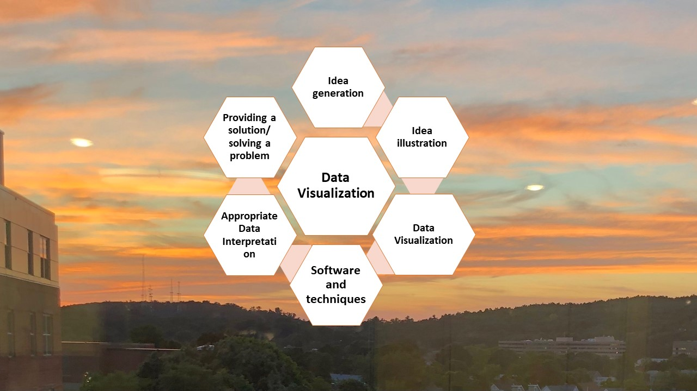

# Software Engineering

The project provides an introduction to software engineering design cycle. 

Confidential information is not displayed. Please download the executable in for details. 

All images are either custom by Alpa D Desai or a reference name is included 

Most of the images are custom.

Details reference https://github.com/alpaddesai/DataVisualizationIS

Additional details on computer science related projects please reference : https://github.com/alpaddesai/ObjectOrientedDesignProgramming, https://github.com/alpaddesai/Algorithms, https://github.com/alpaddesai/C_Programming, https://github.com/alpaddesai/CodingCombinatorialOptimization, https://github.com/alpaddesai/ObjectOrientedProgrammingCSharp, https://github.com/alpaddesai/JavaObjectOrientedProgramming, https://github.com/alpaddesai/BigDataDataScience, https://github.com/alpaddesai/IntroWebDevHealthCareProject, https://github.com/alpaddesai/IntroductionToCompilerDesignAutomataTheory,  https://github.com/alpaddesai/InternetOfThings, https://github.com/alpaddesai/IntroductionToCryptography, https://github.com/alpaddesai/DatabaseManagementDesign, https://github.com/alpaddesai/ModelsofComputationandSynthesis, https://github.com/alpaddesai/DataVisualizationIS, https://github.com/alpaddesai/ProgrammingDesignParadigm, https://github.com/alpaddesai/FoundationsOfSoftwareEngineering, https://github.com/alpaddesai/EngineeringProjectManagement and https://github.com/alpaddesai/DesignVerification.

#### Paid Employment: https://github.com/alpaddesai/AdvancedSoftwareEngineering and https://github.com/alpaddesai/DesignVerification
#### Sample Revenue Generating Project: https://github.com/alpaddesai/HW_SW_Integration_ProductSupport
#### Popular Vote Project: https://github.com/alpaddesai/MicrocontrollerDrivers
#### Populare Vote Topics: Data Structures and Algorithms, popular exam: https://github.com/alpaddesai/GraduateAptitudeTestEngineering_ComputerScienceDept 
#### Popular Vote Topic: Computer Architecture Exam: https://github.com/alpaddesai/GraduateAptitudeTestEngineering_CS
#### Entrance Test: https://github.com/alpaddesai/GraduateRecordExamTestScores
#### Admission Letter: https://github.com/alpaddesai/GraduateKhouryAdmissionLetter
#### Cover Letters: https://github.com/alpaddesai/JobSearch and https://github.com/alpaddesai/SoftwareEng_CoverLetters
#### Learning with Certifications https://github.com/alpaddesai/UdemyCertificationsComputerScience

## Ethics and Integrity

