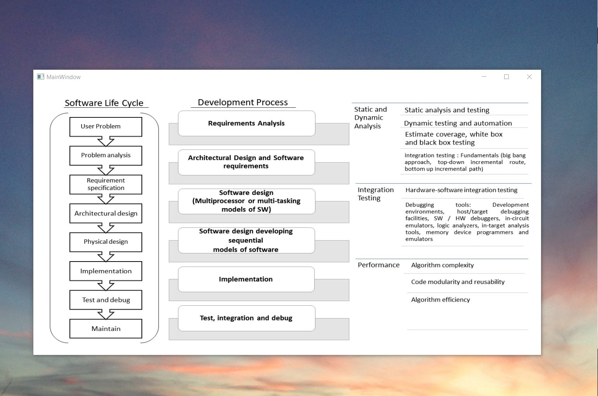

# Software Engineering

The project provides an introduction to software engineering design cycle. 

Confidential information is not displayed. Please download the executable in for details. 

All images are either custom by Alpa D Desai or a reference name is included https://github.com/alpaddesai/SoftwareEngineering/releases.

Most of the images are custom.

Additional details on computer science related projects please reference : https://github.com/alpaddesai/ObjectOrientedDesignProgramming , https://github.com/alpaddesai/Algorithms, https://github.com/alpaddesai/DataMining, https://github.com/alpaddesai/CodingCombinatorialOptimization , https://github.com/alpaddesai/DataStructures, https://github.com/alpaddesai/ObjectOrientedProgrammingCSharp, https://github.com/alpaddesai/ATMRegressionTestSuite, https://github.com/alpaddesai/DeployITStrategy , https://github.com/alpaddesai/BigDataDataScienceMachineLearning, https://github.com/alpaddesai/IntroWebDevHealthCareProject,  https://github.com/alpaddesai/MicroControllerDrivers, https://github.com/alpaddesai/AgileMethodology, https://github.com/alpaddesai/InternetOfThings,  https://github.com/alpaddesai/CodingRTOS , https://github.com/alpaddesai/CompilerDesign, https://github.com/alpaddesai/DatabaseManagementDesign , https://github.com/alpaddesai/ModelsofComputationandSynthesis and https://github.com/alpaddesai/MobileandGamingDevelopment.

